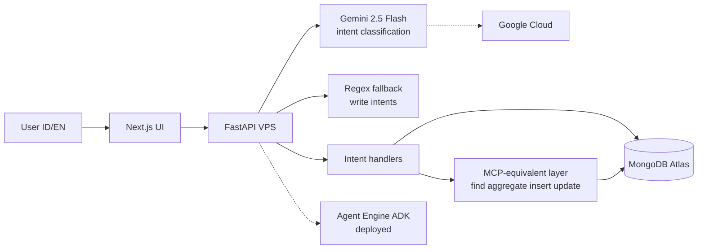

# Wargio — AI Agent for Indonesia's Micro-Retailers

> Built for [Google Cloud Rapid Agent Hackathon 2026](https://rapid-agent.devpost.com/) | **MongoDB Track**

[](https://github.com/adindamochamad/wargio/actions/workflows/ci.yml)

## What is Wargio?

Wargio is an AI business assistant for Indonesian warung owners. Ask in natural **Bahasa Indonesia** or **English** — stock, debts, sales — and the agent reasons over **live MongoDB Atlas** data, then takes action (not just answers).

## Demo

| Resource | Link |
|----------|------|
| **Live app** | https://wargio.adindamochamad.com |
| **Demo video** | _(YouTube — see [Hari 7 script](docs/hari7-demo-video.md))_ |
| **Judge verify** | `export WARGIO_PRODUCTION_URL=https://wargio.adindamochamad.com && bash scripts/judge_verify.sh` |

Toggle **EN** in the header for English UI + agent responses (for judges).

## Architecture



**Production path:** User → Next.js → FastAPI → Gemini classification (+ regex for write) → `atlas_tools` (same operations as MongoDB MCP) → Atlas.

**Why PyMongo-equivalent in production?** MCP stdio adds latency; production uses identical tool semantics (`find`, `aggregate`, `insertOne`, `updateOne`) via `atlas_tools`. **MCP server verified locally:** `npm run verifikasi:mcp`.

## Tech Stack

| Layer | Technology | Version / notes |
|-------|------------|-----------------|
| Agent classification | Gemini 2.5 Flash | Google AI / Vertex |
| Agent Engine | Google ADK | `AGENT_ENGINE_ID` deployed |
| Data | MongoDB Atlas M0 | Live, `wargio_demo` |
| MCP | mongodb-mcp-server | Verified + optional live stdio |
| Vector search | Atlas Search 768d cosine | `products_vector_index` |
| API | Python 3.11+, FastAPI, Pydantic v2 | |
| DB driver | PyMongo Async | |
| Frontend | Next.js App Router, TypeScript, Tailwind | |
| Deploy | Docker + Nginx + HTTPS (VPS) | [docs/deploy-vps.md](docs/deploy-vps.md) |

## MongoDB Integration

- **Collections:** `products`, `transactions`, `customers`, `agent_sessions`
- **8 intents:** `check_stock`, `check_debt`, `restock_alert`, `sales_report`, `record_sale`, `record_payment`, `debt_collection`, `sales_forecast`
- **Fuzzy products:** exact alias → partial (≥0.8) → vector search (≥0.85, Gemini embedding 768d)
- **Write safety:** user confirmation required before `insertOne` / `updateOne`
- **Aggregations:** sales reports, day-of-week forecast

## Google Cloud Integration

| Service | Usage |
|---------|--------|
| **Gemini 2.5 Flash** | Intent classification; product embeddings (768d) |
| **Agent Engine (ADK)** | Deployed agent (`docs/setup-agent-builder.md`) |
| **Vertex AI** | Optional path when `GOOGLE_CLOUD_PROJECT` set |

Check production: `curl -s https://wargio.adindamochamad.com/api/health`

## Local Development

### Prerequisites

- Python 3.11+
- Node.js 20+
- MongoDB Atlas cluster + connection string
- Google Cloud project + Gemini API key (optional but recommended)

### Backend

```bash
cd backend
python -m venv .venv && source .venv/bin/activate
pip install -r requirements.txt

cp ../.env.example ../.env   # MONGODB_URI, GEMINI_API_KEY, etc.

python ../scripts/buat_indeks.py
python ../scripts/buat_vector_index.py --bebaskan-slot-sample
python ../scripts/seed_data.py
python ../scripts/isi_embedding_produk.py

uvicorn app.main:aplikasi --reload --host 0.0.0.0 --port 8000
```

### Frontend

```bash
bash scripts/jalankan_dev.sh          # API + MCP off = UI cepat
cd frontend && npm install && npm run dev
```

Open http://localhost:3000

### Verify MCP (hackathon requirement)

```bash
npm run verifikasi:mcp          # MCP tools → Atlas
npm run verifikasi:mcp-live     # stdio pool live (lambat)
```

## Production

```bash
bash scripts/siapkan_env_production.sh https://your-domain.com
docker compose -f deploy/docker/docker-compose.yml --env-file deploy/.env.production up -d --build
bash scripts/judge_verify.sh
```

Full guide: [docs/deploy-vps.md](docs/deploy-vps.md)

## Environment Variables

See [`.env.example`](.env.example). Never commit secrets.

| Variable | Purpose |
|----------|---------|
| `MONGODB_URI` | Atlas connection |
| `GEMINI_API_KEY` | Classification + embeddings |
| `AGENT_ENGINE_ID` | ADK deployed agent |
| `MCP_LIVE_ENABLED` | `false` in production (latency) |
| `API_INTERNAL_URL` | SSR dashboard fetch (Docker: `http://api:8000`) |

## Running Tests

```bash
# Backend (needs MONGODB_URI for integration tests)
cd backend && pip install -r requirements-dev.txt
pytest ../tests -q

# Frontend
cd frontend && npm run test

# Hari 6 gates
python scripts/verifikasi_hari6.py

# Production smoke (8 intent + write + EN)
export WARGIO_PRODUCTION_URL=https://wargio.adindamochamad.com
bash scripts/smoke_production.sh
```

## Submission

- Devpost copy: [docs/devpost-submission.md](docs/devpost-submission.md)
- Demo video script: [docs/hari7-demo-video.md](docs/hari7-demo-video.md)
- Track: **MongoDB**

## License

MIT — see [LICENSE](LICENSE).
